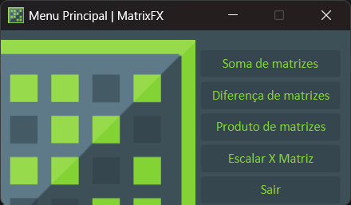
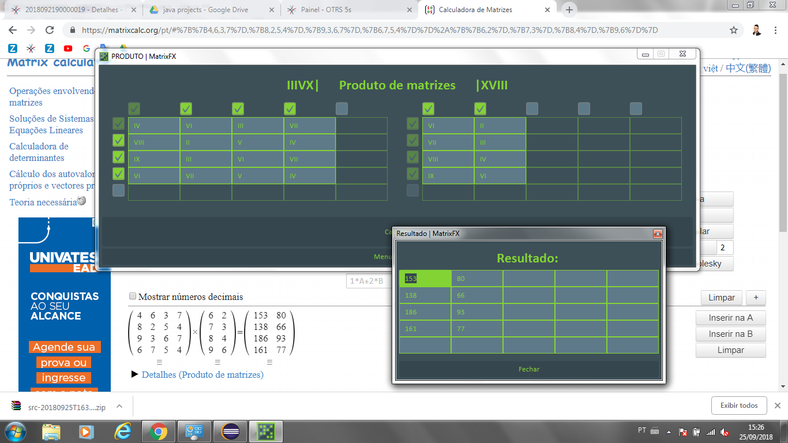
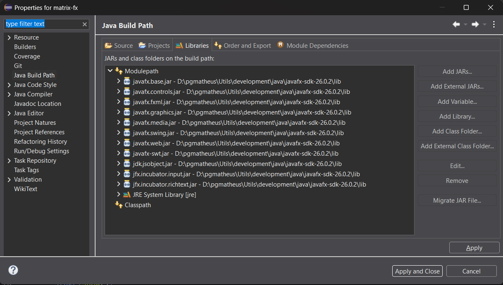
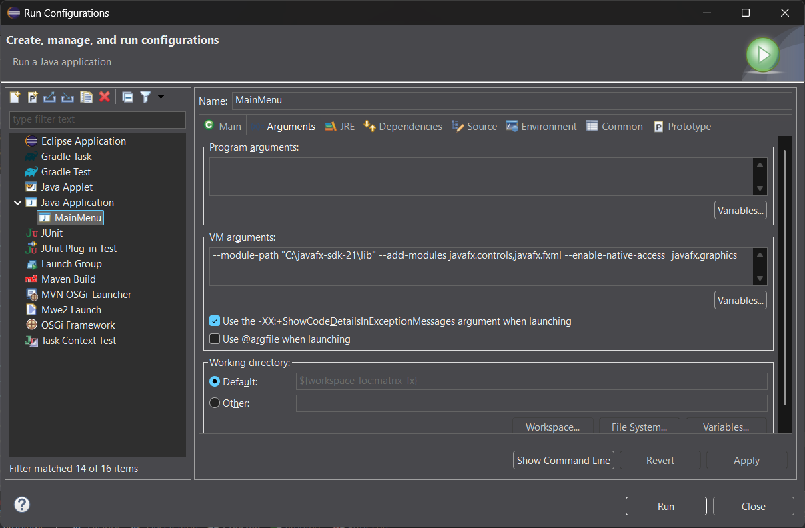

# MATRIX FX - pgmatheus-code 

---

## Origem

O Matrix FX é um software com propósito educacional, desenvolvido originalmente em 2018 como parte da disciplina de Lógica de Programação e Algoritmos do curso de Análise e Desenvolvimento de Sistemas no IFRS-BG.
O projeto permaneceu arquivado até ser revisitado em 2026, quando passou por uma atualização completa para voltar a funcionar nas versões modernas do Java e do JavaFX.

A ideia central sempre foi simples: permitir operações básicas com matrizes.
O diferencial, porém, está no fato de que toda a lógica foi construída para trabalhar com números romanos, desde o input até o processamento interno. Isso trouxe desafios interessantes — tanto conceituais quanto de implementação — e acabou transformando um exercício comum em um projeto bem mais divertido.

Vale lembrar que, na época, não havia exigência alguma para criar uma interface gráfica, muito menos utilizando JavaFX. Também não era necessário aceitar números romanos.
Mas, como entusiasta de JFX, resolvi ir além do mínimo e transformar o trabalho em uma experiência visual e interativa.

---

## Requerimentos atuais

Para rodar a versão revisada em 2026, o projeto foi atualizado para funcionar com:
- JDK 26.0.2.1
- JRE 26.0.2
- openJFX 26.0.2

---

## Revisão (2018-2026)

Ao reabrir o projeto anos depois, foi necessário reinstalar o ambiente e reconfigurar o JavaFX manualmente.
O processo envolveu:

- Instalar as versões atuais do JDK/JRE e do openJFX.
- Adicionar os JARs do JavaFX ao projeto:

*** Clique direito no Projeto > Properties > Java Build Path > Add External JARs *** e selecione todos os arquivos da pasta lib do openJFX.

E finalmente acrescentar o seguinte comando:

#### --module-path "C:\javafx-sdk-21\lib" --add-modules javafx.controls,javafx.fxml --enable-native-access=javafx.graphics

via: Run > Run Configurations > Java Appication > Main > Aba "Arguments" > VM Arguments.

**Observação: O plugin e(fx)clipse 3.8.0 foi instalado via Marketplace para garantir compatibilidade com o JavaFX dentro do Eclipse.

---

Made with 💻 by [**pgmatheus-code**](https://github.com/pgmatheus-code)
